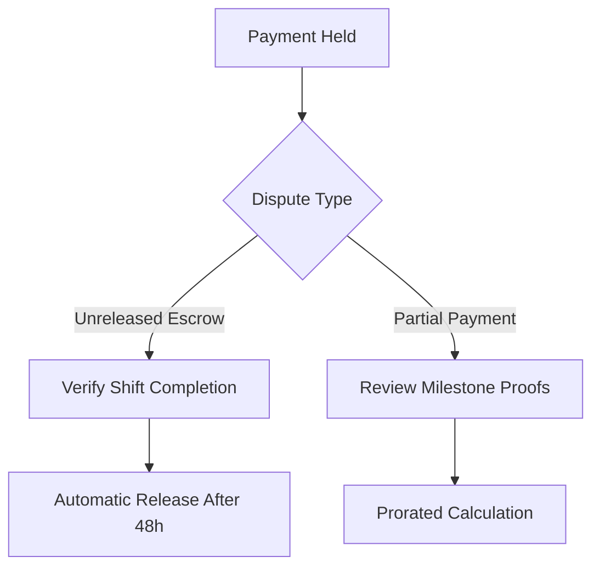
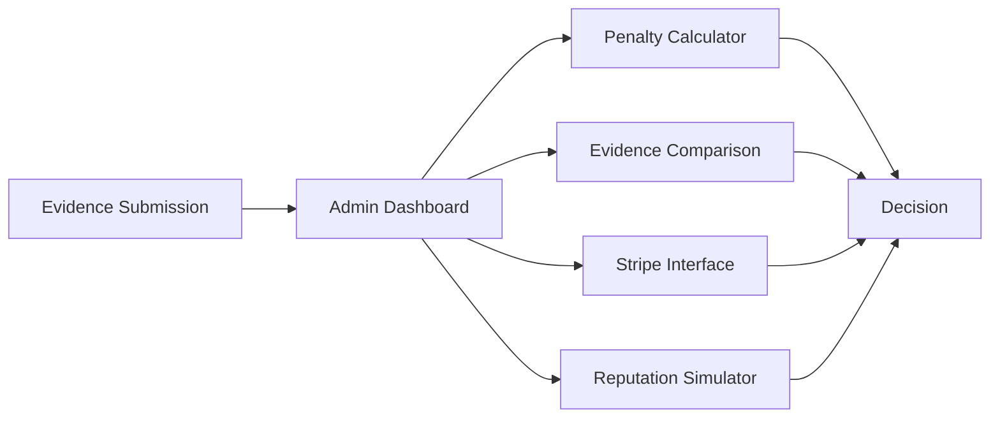
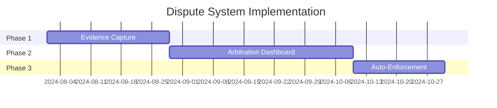

# TEMPII Platform: Escrow Dispute Resolution Framework  
**Version:** 2.3 | **Confidential**

---

## 1. Introduction to TEMPII Escrow System  
TEMPII's payment security system provides financial protection through:  
- 💳 Stripe-powered payment holds  
- ⚖️ Automated penalty enforcement  
- 🛡️ HIPAA-compliant resolution workflows  
- 🎯 <1% payment dispute target (vs. 15% industry standard)  

**Key Metrics:**  
- ✅ 85% shift fill rate within 24 hours  
- ⏱️ Auto-payment release within 2 hours of shift completion  
- ⏳ 72-hour dispute resolution SLA  

---

## 2. Dispute Categories and Scenarios  

### 2.1 Shift Cancellation Disputes  
| Type | Description | Evidence Required |  
|------|-------------|-------------------|  
| **No-Show Claims** | Practice claims professional didn't arrive | 📍 Timestamped location logs, 💬 Communication history |  
| **Late Cancellation** | Disagreements over 24-hour window | ⏰ Cancellation timestamps, 🚨 Emergency documentation |  

### 2.2 Service Quality Disputes  
| Type | Description | Evidence Required |  
|------|-------------|-------------------|  
| **Substandard Work** | Practice refuses payment for defective work | 📋 Shift requirements, 📸 Before/after photos |  
| **Scope Mismatch** | Professional claims tasks exceeded agreement | ✍️ Signed work scope documentation |  

### 2.3 Payment Release Disputes  


### 2.4 Cancellation Penalty Disputes  
- ⚠️ **Unfair Fee Deductions**: Challenges to 50% penalty  
- 🔒 **72-Hour Restriction Appeals**: Professionals contesting work bans  

### 2.5 Technical Failure Disputes  
- 🔄 Double payments/system errors  
- ❌ Failed auto-release of escrow  

### 2.6 Rating & Reputation Disputes  
- ⭐ Defamatory/fake review challenges  
- 📉 Unfair rating allegations  

### 2.7 Compliance Disputes  
- 🏥 HIPAA violation claims  
- 📑 Document verification rejections  

### 2.8 Communication Breakdowns  
- 📵 Unresponsive parties  
- 🕒 Schedule alignment conflicts  

---

## 3. Dispute Resolution Process  

### 3.1 Evidence Collection (72-hour window)  
**Required Documentation:**  
- 📍 Geolocation check-in/out records  
- 💬 In-app chat transcripts  
- ✅ Shift completion checklists  
- 📸 Before/after work documentation  
- 🏢 Third-party facility logs  

### 3.2 Admin Arbitration Tools  


### 3.3 Resolution Enforcement  
```python
# Stripe Refund Implementation
stripe.Refund.create(
  payment_intent='pi_xxx',
  amount=2500,  # $25.00
  reason='dispute_resolution',
  metadata={
    'case_id': 'DSP-2024-189',
    'admin_id': 'admin_2284',
    'resolution_type': 'partial_refund'
  }
)
```

**Post-Resolution Actions:**  
- 🔄 Automatic reputation score updates  
- ⏸️ Cooling-off periods for repeat disputers  
- 📚 Mandatory training modules  

---

## 4. Prevention Mechanisms  
| Mechanism | Implementation | Reduction Impact |  
|-----------|----------------|------------------|  
| **Shift Verification** | Mandatory geolocation tagging | 65% fewer no-shows |  
| **Cancellation Audit** | Cryptographic timestamps | 80% timing disputes |  
| **Pre-Shift Docs** | Digital work agreements | 85% scope issues |  
| **Payment Dashboard** | Real-time escrow status | 70% fewer inquiries |  
| **AI Monitoring** | Dispute prediction algorithms | 40% early resolutions |  

---

## 5. Technical Implementation  
### 5.1 Core Components  
```yaml
evidence_storage:
  type: Azure Blob Storage
  compliance: HIPAA
  retention: 7 years
  encryption: SSE + TDE

monitoring:
  - alert: DisputeCaseCreated
    type: customLogs
    query: DisputeEvents | where Status == "Opened"
    action: 
      - EmailAdminTeam
      - CreateServiceTicket

stripe_webhooks:
  required:
    - charge.dispute.created
    - payment_intent.canceled
    - charge.refunded
```

### 5.2 Implementation Timeline  


### 5.3 Azure Integration  
```powershell
# Create HIPAA-compliant storage
New-AzStorageAccount -ResourceGroupName "TEMPII-Prod" `
  -Name "tempii-evidence" `
  -SkuName Standard_ZRS `
  -Location "EastUS" `
  -EnableHttpsTrafficOnly $true `
  -AllowBlobPublicAccess $false `
  -MinimumTlsVersion TLS1_2
```

---

**Operational Guidelines:**  
1. All disputes must be logged in Azure Monitor  
2. Evidence retention period: 7 years  
3. Maximum resolution time: 72 business hours  
4. Stripe dispute fees charged to losing party  
